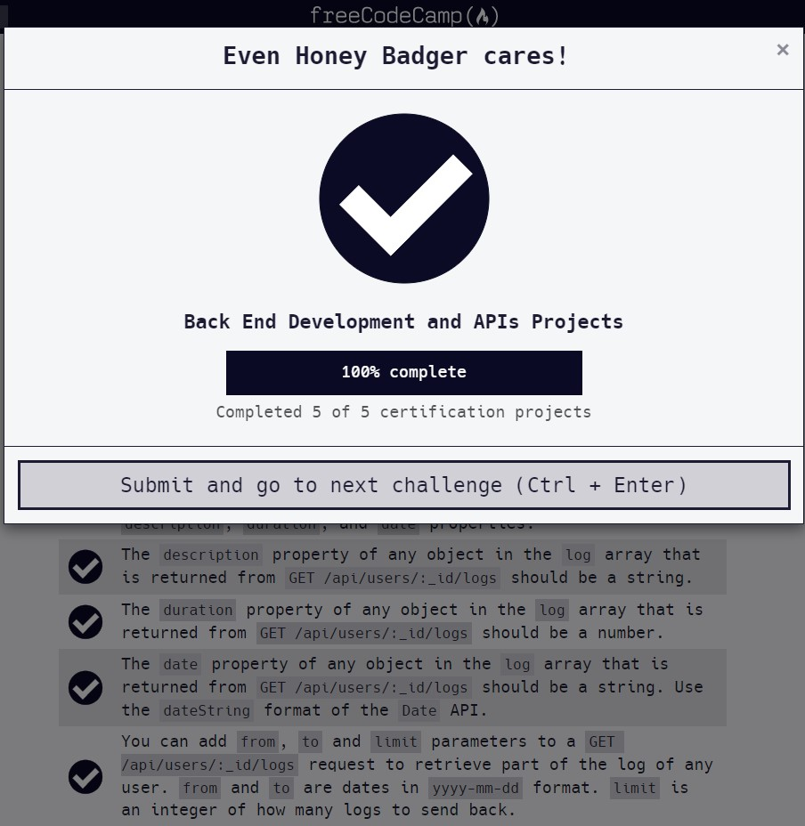

# Exercise Tracker

#### Documentation can be found on : [https://github.com/viktoriussuwandi/Exercise-Tracker](https://github.com/viktoriussuwandi/Exercise-Tracker)

This is the result to complete the Exercise Tracker project.
Instructions for building this project can be found at 
[https://www.freecodecamp.org/learn/apis-and-microservices/apis-and-microservices-projects/exercise-tracker](https://www.freecodecamp.org/learn/apis-and-microservices/apis-and-microservices-projects/exercise-tracker)

###  Some of additional features :
     * Avoid duplicate username
     * Avoid duplicate user_id using recursive function
     * Using local file to save user input
     * Using id generator to generate user id
     * Using express validator to validate user input

### Test Scenario :
- You should provide your own project, not the example URL.
- You can POST to /api/users with form data username to create a new user.
- The returned response from `POST` `/api/users` with form data `username` will be an object with `username` and `_id` properties.
- You can make a `GET` request to `/api/users` to get a list of all users.
- The `GET` request to `/api/users` returns an array.
- Each element in the array returned from `GET` `/api/users` is an object literal containing a user's `username` and `_id`.
- You can POST to `/api/users/:_id/exercises` with form data `description`, `duration`, and optionally `date`. If no date is supplied, the `current date` will be used.
- The response returned from `POST` `/api/users/:_id/exercises` will be the user object with the exercise fields added.
- You can make a `GET` request to `/api/users/:_id/logs` to retrieve a full exercise log of any user.
- A request to a user's log `GET` `/api/users/:_id/logs` returns a user object with a `count` property representing the number of exercises that belong to that user.
- A `GET` request to `/api/users/:_id/logs` will return the user object with a `log` array of all the exercises added.
- Each item in the `log` array that is returned from `GET` `/api/users/:_id/logs` is an object that should have a `description`, `duration`, and `date` properties.
- The `description` property of any object in the `log` array that is returned from `GET` `/api/users/:_id/logs` should be a string.
- The `duration` property of any object in the `log` array that is returned from `GET` `/api/users/:_id/logs` should be a number.
- The `date` property of any object in the `log` array that is returned from `GET` `/api/users/:_id/logs` should be a string. Use the `dateString` format of the `Date` API.
- You can add `from`, `to` and `limit` parameters to a `GET` `/api/users/:_id/logs` request to retrieve part of the log of any user. `from` and `to` are dates in `yyyy-mm-dd` format. `limit` is an integer of how many `logs` to send back.

### Test Result :

